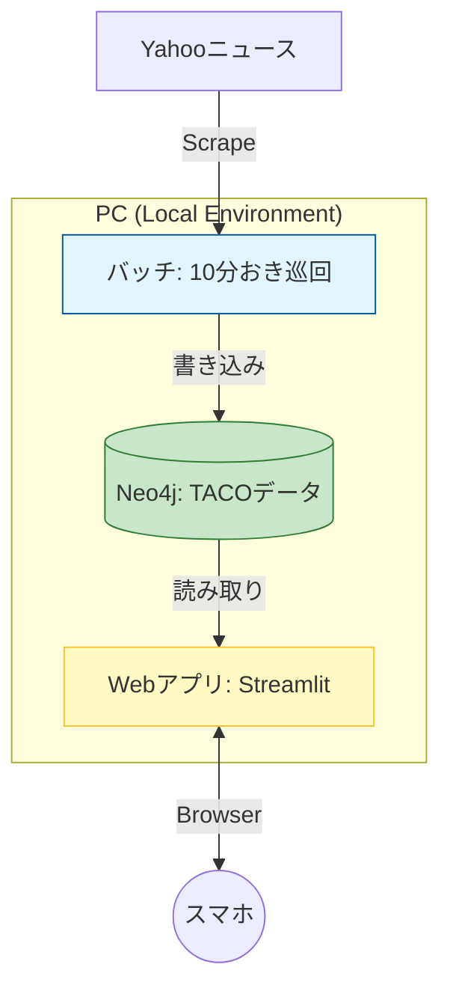

# TACOシステム：PoC構築仕様書 (v1.0)

本ドキュメントは、ある人物の言動がもたらす経済的影響を「TACO係数」としてスコアリングし、リアルタイムで可視化する自律型GraphRAGシステムの構築案である。

---

## サブシステム構成

## システム構成図

### 1. バッチ側：自律型クローラー（TACO Scan）
「シビュラシステム」の監視の目に相当。

- **役割**: 10分おきに自動起動、または常駐してNewsAPI.org/Google News RSSを監視
- **処理フロー**: ニュース取得 → LLMでTACO係数を算出 → Neo4jを更新
- **実装例**: scheduleライブラリや`while True: sleep(600)`を使ったシンプルなPythonスクリプト

### 2. Webアプリ側：ダッシュボード（TACO UI）
「監視官の端末」に相当。

- **役割**: スマホのブラウザからアクセスし、現在の「色相（リスク）」を確認
- **処理フロー**: ブラウザから質問入力 → Neo4jから最新の係数と相関パスを読み取る → LLMが回答生成
- **実装例**: Streamlitを使えば、数行のコードでスマホ対応のWeb画面が作成可能

---

## 1. システム概要

- ある人物の言動を監視し、Aggression（攻撃性）、Confusion（混乱）、Opportunity（好機）の3軸で解析。
- Neo4jのグラフ構造を用いて、特定の企業やセクターへのリスク伝播をシミュレーション。

---

## 2. 技術スタック（完全ローカル / 低コスト構成）

| コンポーネント | 選定ツール | 備考 |
|:---|:---|:---|
| LLM (Reasoning) | Ollama (Llama 3.3等, Phi-2, Mistral 7B) | PCローカル実行（実費ゼロ） |
| Graph DB | Neo4j (Docker) | データの因果関係・相関を管理 |
| Orchestrator | LangGraph (Python) | エージェントのループ制御 |
| UI Framework | Streamlit | モバイル対応ダッシュボード |
| Data Source | NewsAPI.org, Google News RSS (経済/国際) | API/RSSによる定期取得（Yahooニュースから変更） |
| クローリング | clinerulrs（Pythonライブラリ） | NewsAPI.org, Google News RSS等のデータ取得に利用 |

---

## 利用技術一覧

- Python 3.12.8
- clinerulrs（クローリング用ライブラリ）
- requests
- feedparser
- Neo4j公式Pythonドライバ
- Streamlit
- LangGraph
- Ollama（ローカルLLM）
- Phi-2（軽量LLM）
- Mistral 7B（軽量LLM）

--- 

## 3. データモデル (Neo4j)

### ノード (Nodes)
- **Person**: 名前, 現在のTACO係数, 最終更新
- **Sector**: 業種名 (例: 自動車, 半導体)
- **Event**: ニュースタイトル, 発言内容, 発信日時

### リレーション (Relationships)
- **INFLUENCES**: 影響力 (weight: 0.0-1.0)
- **OPPOSES**: 対立関係
- **MENTIONS**: ニュース内での言及

---

## 4. 処理プロセス (LangGraph Workflow)

1. **Crawler**: NewsAPI.orgおよびGoogle News RSSから「ある人物」や経済関連の最新記事をAPI/RSS経由で抽出（Yahooニュースから変更）
2. **Extractor**: LLMで記事を解析。人名・組織を抽出し「名寄せ」を実行
3. **TACO Analyst**: 記事内容から A, C, O の各数値を算出（0-100）
4. **Graph Updater**: Neo4j上の既存ノードに値をマージ。関連セクターの係数も動的に更新
5. **Alert Generator**: 係数が閾値（シビュラ的基準）を超えた場合、通知用Stateを更新

---

## 追加・変更履歴

- データ取得元を「Yahooニュース」から「NewsAPI.org」「Google News RSS」に変更
- 経済情報もNewsAPI.orgおよびGoogle News RSSから取得する方針に統一
- データ取得時は各サービスのrobots.txtおよび利用規約を必ず確認し、許可された範囲のみ取得を行うことを明記

--- 

## 5. TACO係数の判定基準 (LLM指示用)

- **Aggression (A)**: 対抗関税、制裁、名指し批判
- **Confusion (C)**: 前言撤回、予測不能な人事、市場のボラティリティ向上
- **Opportunity (O)**: 減税示唆、規制緩和、特定産業への優遇政策

---

## 6. スマホ用UI設計（Streamlit PWA）

- **色相計（Hue Meter）**: 選択したセクターのリスク状態を「シビュラカラー」で表示
- **ドミネーター・モード**: 係数300超えの銘柄を「排除対象（Sell/Avoid）」としてリスト表示
- **相関図表示**: 特定の発言がどの企業まで波及しているかをツリー形式で表示